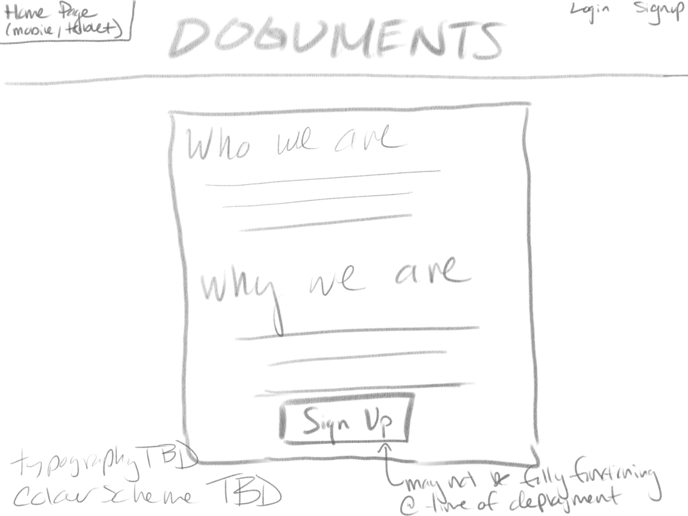
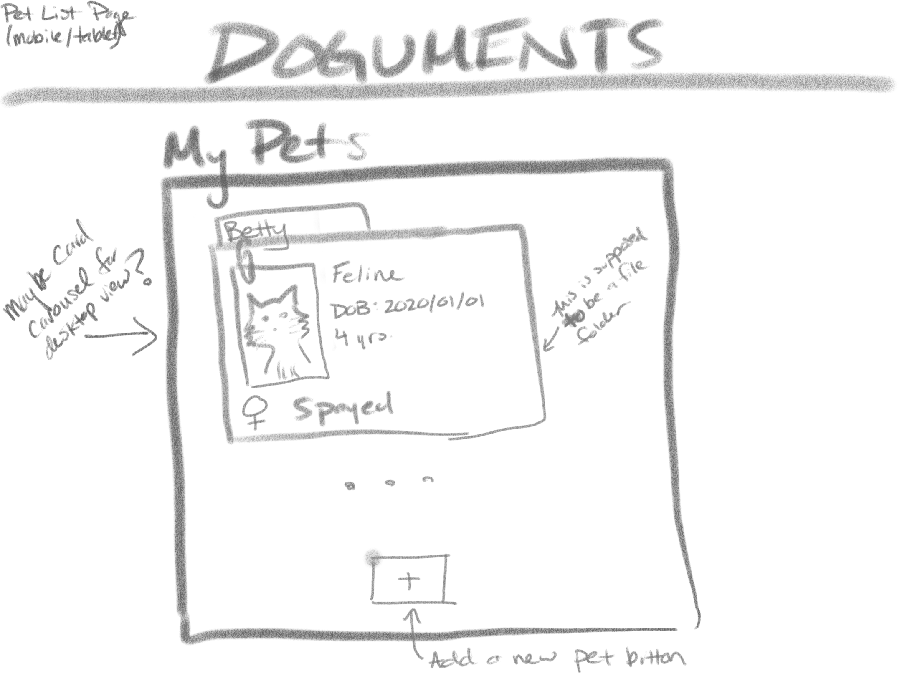
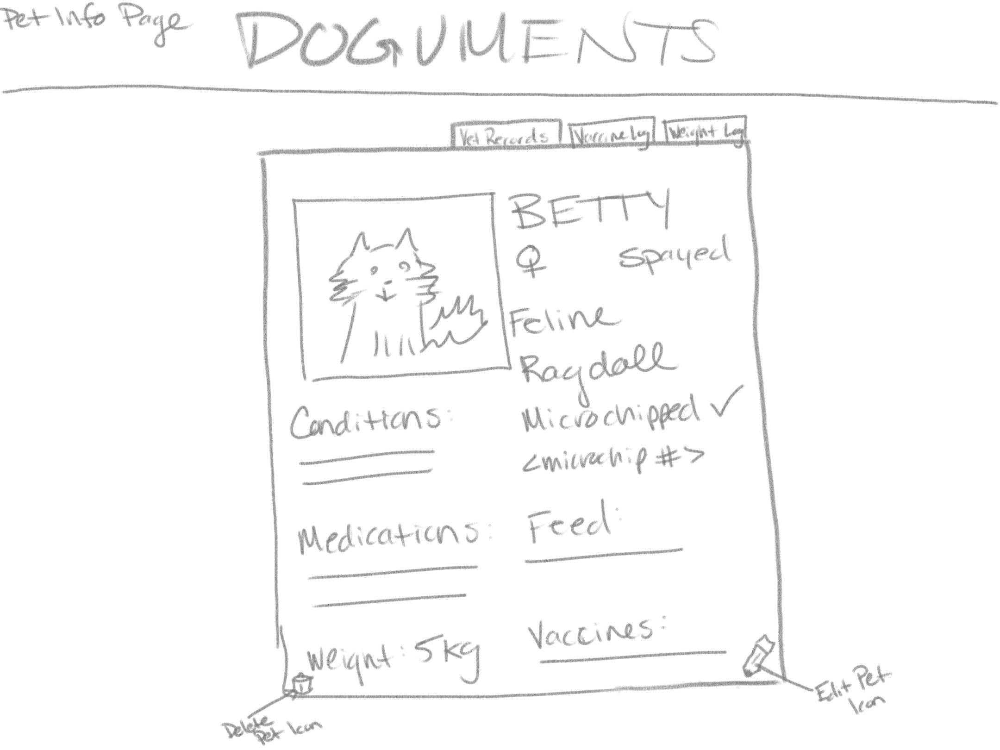
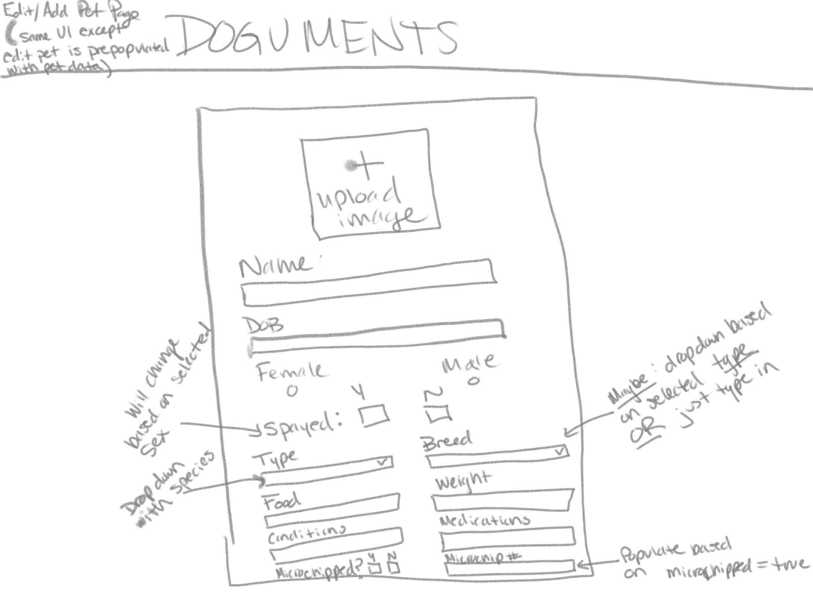
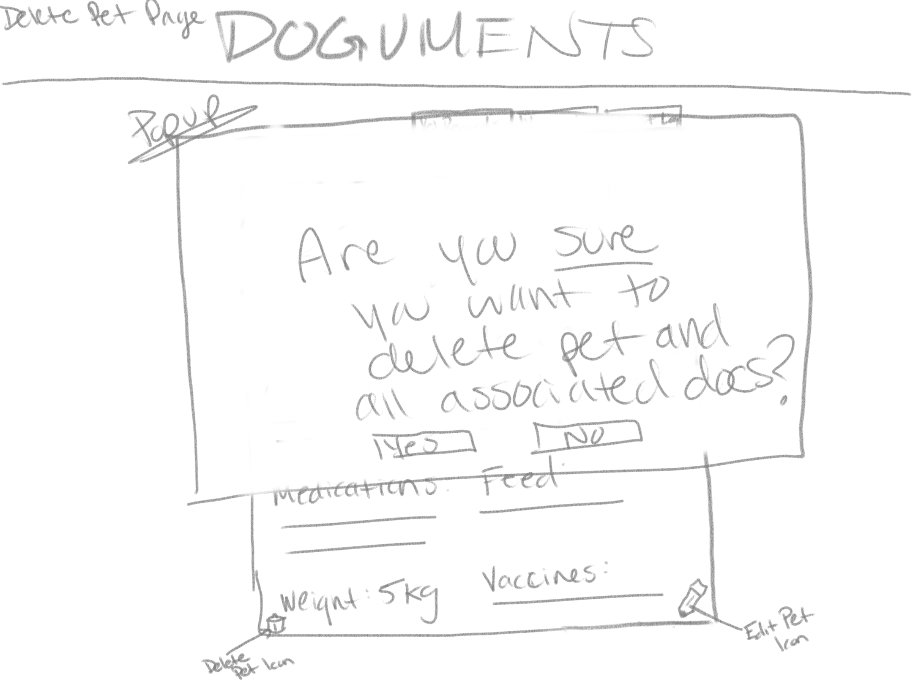
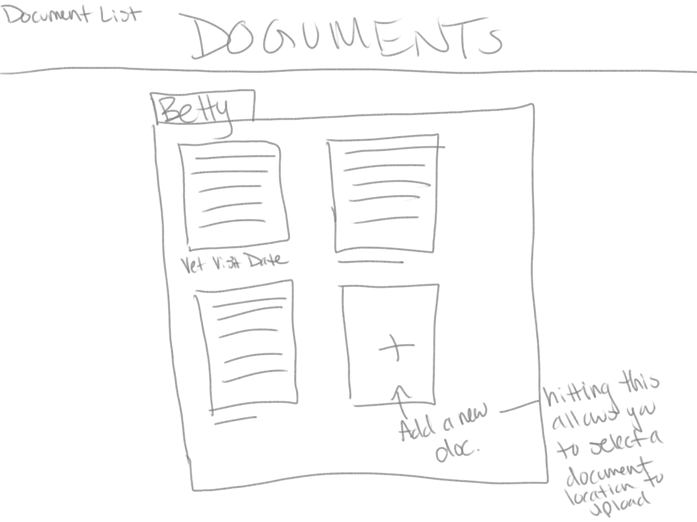
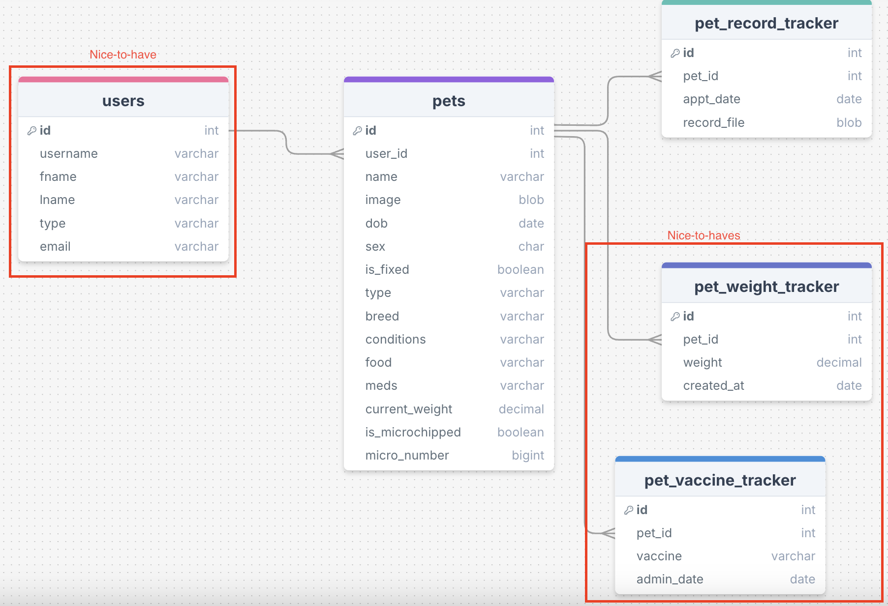

# Project Title

Working title: Doguments

## Overview

Doguments is a CRUD application designed to hold of all your furry friends' crucial information. From keeping veterinary records in one secure spot to tracking changes in your pet's weight, exercise, or consumption trends, Doguments is there to be your animal companion's companion.

### Problem Space

It can be difficult to keep track of all your pets' veterinary records, especially when you have a pet with a chronic condition that requires frequent veterinary visits. While veterinary services maintain their clients' records, it is beneficial for the client to have easy access to their pets' veterinary history. When emergencies arise and a pet must attend a different veterinary hospital, having the animal's medical history with the client saves valuable time spent having those records transferred over. Furthermore, during off-hour emergency services, it may not be possible to have those records transferred at all.
Additionally, in the veterinary industry record-keeping and tracking is a known paintpoint for veterinary professionals. Time that could be spnt attending to patients is spent transferring records to other offices. By providing users access to their own pet's veterinary records in one secure spot, the demand on veterinary professionals is lifted as the client takes on a greater responsibility in their pets' healthcare.

In short, Doguments aims to:

-   Reduce the demand for veterinary professionals by decreasing need to transfer documents.
-   Allow the user easy access to their pets' documents in case of emergency.
-   Keep all a pet's crucial information in one spot (conditions, medications, food etc.) to allow ease of access for both the user and veterinary professionals during intake, and keep track of any potentially concerning trends (change in food/water consumption, vomiting, changes in urination/defecation).
-   Simplify the user's scheduling and history by keeping a log of all veterinary visits and any upcoming scheduled visits.

### User Profile

Pet owners:

-   "pet parents", those that wish to take a larger role in their pet's healthcare
-   keep track of changes in their pet's behaviour
-   have all vet records/vaccination history in one spot
-   keep vet visit history/upcoming visits in one spot

Veterinary professionals:

-   upload veterinary records to clients' profiles
-   access stored pet information

### Features

-   as a user I want to:
    -   see all my added pets
    -   add a profile for my pet
        -   add the following information: image (optional), age + date of birth, species, breed (optional), sex, select spayed or neutered, microchipped y or n and if so add the number, known medical conditions and when it was diagnosed, any medications and dosage/fequency, type of feed and amount fed per day / # of meals
        -   update the above information as needed
    -   see a log of my pet's vaccination history
        -   add or update information as needed
    -   see a log of my pet's weight
        -   add new weights as necessary
    -   keep an addional section for notes about changes in my pet's behaviour
    -   upload and access my pet's veterinary records

## Implementation

### Tech Stack

-   React
-   Javascript
-   MySQL
-   Node.js
-   Client libraries:
    -   react
    -   react-router
    -   react-router-dom
    -   axio-sass
    -   sass
-   Server libraries:
    -   knex
    -   express
    -   cors
    -   uuid
    -   dotenv
    -   multer

### APIs

No external API, I will create my own.

### Sitemap

Home Page - explains what we are, why we're doing it, how to use
My Pets - a page with a card for each pet the user has added with the option to view more details. Each card contains basic details (image, name, DOB, sex)
Specific Pet Page - shows all the detailed information about a pet with the option to edit information. Option here to see \ vet records, vet appointment history, vaccination history, weight tracking, and any notes
Edit Pet Page - here the user can update information as needed and submit
Delete Pet Page - delete pet and all associated information/documents
Add Pet Page - a new pet can be added
Document Upload Page - here the user can upload their veterinary records and select which of their pets it is for. Additionally they can note the date of the vet appointment

### Mockups

Home


Pet List


Pet Page


Edit/Add Pet


Delete Pet


Documents/Upload


### Data



### Endpoints

GET /pets

-   get a list of a user's added pets

Response:

```
[
    {
        "id": 1,
        "name": "Rover",
        "image:" "img pathway",
        "dob:" "2020-12-29",
        "sex:" "M",
        "is_fixed:" true,
        "type:" "canine",
        "conditions:" "null",
        "food:" "Purina Pro Plan Large Breed",
        "meds:" "null",
        "current_weight:" "40.2",
        "is_microchipped:" true,
        "micro_number:" "977200000000000",
    },

    {
        "id": 2,
        "name": "Cleo",
        "image:" "img pathway",
        "dob:" "2015-11-19",
        "sex:" "F",
        "is_fixed:" true,
        "type:" "feline",
        "conditions:" "null",
        "food:" "Meow Mix",
        "meds:" "null",
        "current_weight:" "8.9",
        "is_microchipped:" true,
        "micro_number:" "977300000000000",
    },
    ...
]
```

GET /pets/:id

-   get a profile of a specific pet

Parameters:

-   pet id number

Response:

```
{
    "id": 1,
    "name": "Rover",
    "image:" "img pathway",
    "dob:" "2020-12-29",
    "sex:" "M",
    "is_fixed:" true,
    "type:" "canine",
    "conditions:" "null",
    "food:" "Purina Pro Plan Large Breed",
    "meds:" "null",
    "current_weight:" "40.2",
    "is_microchipped:" true,
    "micro_number:" "977200000000000",
}
```

POST /pets

-   add a new pet profile

Parameters:

-   the following data must be filled out:
    -   name
    -   dob - YYYY-MM-DD format
    -   sex - M or F
    -   is fixed - T or F
    -   type
    -   food
    -   current weight - number up to 2 decimals in kg
    -   is microchipped, optionally microchip number if yes

Response:

```
{
    "id": 1,
    "name": "Buddy",
    "image:" "img pathway",
    "dob:" "2024-01-31",
    "sex:" "M",
    "is_fixed:" false,
    "type:" "canine",
    "conditions:" "null",
    "food:" "Purina Pro Plan Puppy",
    "meds:" "null",
    "current_weight:" "10.0",
    "is_microchipped:" true,
    "micro_number:" "977900000000000",
}
```

PUT /pets/:id

-   update a pet's profile

Parameters:

-   the following data must be filled out and changed from the original:
    -   name
    -   dob - YYYY-MM-DD format
    -   sex - M or F
    -   is fixed - T or F
    -   type
    -   food
    -   current weight - number up to 2 decimals in kg
    -   is microchipped, optionally microchip number if yes

Response:

```
{
    "id": 1,
    "name": "Buddy",
    "image:" "img pathway",
    "dob:" "2024-01-31",
    "sex:" "M",
    "is_fixed:" true,
    "type:" "canine",
    "conditions:" "null",
    "food:" "Purina Pro Plan Puppy",
    "meds:" "null",
    "current_weight:" "10.0",
    "is_microchipped:" true,
    "micro_number:" "977900000000000",
}
```

DELETE /pets/:id

-   remove a pet's profile

Parameters:

-   pet id number

GET /pets/:id/records

-   access a list of a pet's veterinary records and their dates

POST /pets/:id/records

-   upload a new record for a pet

Parameters:

-   pet id number
-   pdf file

```
[
    {
        "id": 1,
        "pet_id": 1,
        "appt_date:" null,
        "record_file:" "example.pdf",
    },
    ...
]
```

Parameters:

-   pet id number
-   pdf file

```
{
    "id": 1,
    "pet_id": 1,
    "appt_date:" null,
    "record_file:" "example.pdf",
}
```

DELETE /pets/:id/record/:recordid

-   remove an existing file from the list of pet records

## Roadmap

-   Set up the project environment:

    -   Create a new Vite React project and install dependencies.

-   Set up Express server and MySQL database.

    -   Install necessary dependencies (React, Express, Knex, CORS, Multer, etc.).

-   Create the initial folder structure:

    -   client/ for React app.
    -   server/ for Express API.

-   Set up basic routing in React (react-router).

-   Design the MySQL database schema:

    -   Tables for pets, vaccinations, weights, vet records.

-   Write migration files using Knex.

-   Develop basic Express API endpoints:

    -   GET /pets, POST /pets, GET /pets/:id, PUT /pets/:id, DELETE /pets/:id.
    -   GET /pets/:id/records, POST /pets/:id/records.

-   Create the Home Page, My Pets Page, Specific Pet Page.

-   Use React components to display pet cards with basic details.

-   Create Add Pet Page.

-   Create a form for pet details.

    -   Integrate form submission to API.
    -   Use Multer for handling file uploads.

-   Create the Specific Pet Page.

    -   Display detailed information about a pet.
    -   Integrate Edit Pet functionality with a form to update pet info.
    -   Implement the Delete Pet functionality.
        -   Add a delete button and handle confirmation.

-   Create Records Page and Upload record functionality:

    -   Use Multer for handling file uploads.
    -   Create a form to upload veterinary records.

-   Conduct thorough testing of all features:

    -   Ensure all CRUD operations work correctly.
    -   Test user interface responsiveness and usability.

-   Add any finishing touches (styling, error handling).

-   Prepare project for deployment (set up environment variables, configure production settings).

---

## Future Implementations

-   Ability for veterinary professionals to access and upload documents on clients' profiles
-   Login and authentication details for clients to access personal list of their pets only
-   Login and authentication details for veterinary staff to access list of their clients only
-   Ability to switch between kg and lbs for pet weight
-   Add ability to add specific notes for a pet - a written log
-   Add a route to display trends in pet weight (add a visual such as a chart)
-   Add a route to access pet's vaccination history (visual display as a calendar or chart)
-   Mobile app
